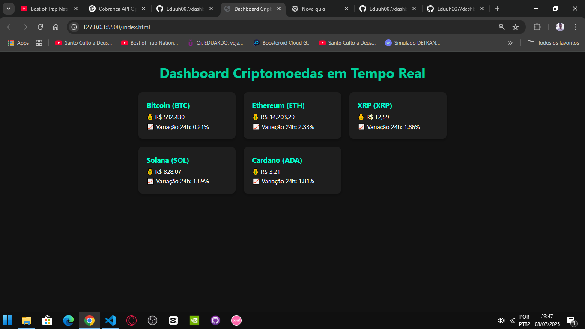

# dashboard-criptomoedas
# 💰 Dashboard de Criptomoedas em Tempo Real

Visualize o valor de criptomoedas como Bitcoin, Ethereum, entre outras, de forma rápida, limpa e atualizada em tempo real. Um projeto pessoal criado com foco em APIs públicas, design moderno e funcionalidade.

 

---

## 🚀 Tecnologias Utilizadas

- **HTML5** – Estrutura da página
- **CSS3** – Estilização moderna e responsiva
- **JavaScript** – Lógica de atualização em tempo real
- **[CoinGecko API](https://www.coingecko.com/)** – Para obter os dados atualizados das criptomoedas

---

## 📦 Como Usar

bash
# Clone o repositório
git clone https://github.com/Eduuh007/dashboard-criptomoedas.git

# Acesse a pasta
cd dashboard-criptomoedas

# Abra o index.html no navegador  aonde colo esse codigo?
